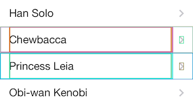

# PTLViewDebugger

## Description
Useful tools for debugging your view layouts.

When a view looks a bit out of place and you can't be tell why, use PTLViewDebugger to figure it out. PTLViewDebugger helps you debug your views by adding colored borders to your view hierarchy just use `ptl_showDebugBorder` to add a randomly colored border to the view or `ptl_identifyViewLayout` to add a border to the view hierarchy you're debugging. If that's not enough, PTLViewDebugger enhances the private  [`recursiveDescription`](https://developer.apple.com/library/ios/technotes/tn2239/_index.html) API so that if you use that while debugging the resulting wall of text is styled with the border colors of each view.
Additional utilities are included for visually debugging views using autolayout. Use `ptl_identifyViewsWithAmbiguousLayout` and `ptl_startAutoLayoutDance` to easily identify which views have ambiguous layout.

## Basic Usage
### In Code

        [view ptl_identifyViewLayout];
        NSLog(@"%@", [view recursiveDescription]);

### In Debugger

- Pause the execution
- Find the address of view you want to debug

        [0x12345678 ptl_identifyViewLayout]
        [0x12345678 recursiveDescription]

- Resume execution so the view updates to display the style

### Output

In app:

In Xcode debugger:

## AutoLayout Usage

### In Code

        [view ptl_identifyViewsWithAmbiguousLayout];
        [view ptl_startAutoLayoutDance:YES];

### In Debugger

- Pause the execution
- Find the address of view you want to debug

        [0x12345678 ptl_identifyViewsWithAmbiguousLayout]
        [0x12345678 ptl_startAutoLayoutDance:YES]

- Resume execution so the view updates to display the style and the animation can start.

### Output

In app:

## Dependencies
- [XcodeColors](https://github.com/robbiehanson/XcodeColors) plugin

## License
[MIT](LICENSE.txt)

## Contact
[Brian Partridge](http://brianpartridge.name) - @brianpartridge on [Twitter](http://twitter.com/brianpartridge) and [App.Net](http://alpha.app.net/brianpartridge)